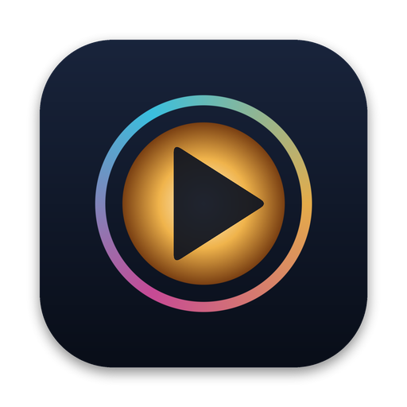

  

<h1 align="center">Cinema64</h1>

<h3 align="center">The cinema on your Mac.<kbd>This app is in early development</kbd></h3>
<h3 align="center"><kbd>This app is in early development</kbd></h3>

  Dolby Vision and HDR films from MKV and MP4, played by macOS itself — in one free, native Mac app.

  <a href="https://github.com/akeisoft/Cinema64/releases/download/0.2.1/Cinema64-0.2.1.dmg"><b>⬇&nbsp;&nbsp;Download for Mac</b></a>
  &nbsp;&nbsp;·&nbsp;&nbsp;
  <a href="https://akeisoft.com">akeisoft.com</a>

  
  
  
  

<!-- A window screenshot with the English interface fits here:

-->

---

Open an MKV or MP4 and see it the way it was mastered. **Cinema64** repackages the film on the fly and hands it to the same playback engine QuickTime uses — so Dolby Vision Profile 5, HDR10 and HLG keep their true colors and real HDR highlights, with no transcoding and no green or purple tint. Subtitles, every audio track and your place in the film come along.

<table>
  <tr>
    <td align="center" width="33%">⚡ <b>Native</b> Built for Apple Silicon. Decoding, HDR and Dolby Vision are done by macOS itself.</td>
    <td align="center" width="33%">🔒 <b>Private</b> Your films never leave your Mac. No account, no ads, no tracking.</td>
    <td align="center" width="33%">🧡 <b>Free</b> Every feature, for everyone. Updates arrive automatically.</td>
  </tr>
</table>

## What it does

| | |
|:--|:--|
| 🎬&nbsp;**Dolby Vision** | Profiles 5, 8.1 and 8.4 from MKV and MP4, rendered by the macOS Dolby Vision pipeline |
| 🌗&nbsp;**HDR and SDR** | HDR10, HLG and regular video, HEVC and H.264 — bright highlights on XDR and HDR displays |
| 🔊&nbsp;**Sound as it was** | AAC, AC-3, E-AC-3, MP3, ALAC and FLAC without transcoding; switch tracks mid-film |
| 💬&nbsp;**Subtitles** | SRT, ASS/SSA, WebVTT, PGS, VobSub and DVB — built in or from a file next to the film; any delay in 0.1 s steps |
| ⏯️&nbsp;**Where you left off** | Every film reopens at the moment you closed it — or from the beginning, in one click |
| 🖥️&nbsp;**At home on macOS** | Full screen, Picture in Picture, drag and drop, the standard Mac player controls |
| 🔍&nbsp;**See what's inside** | The Info panel shows the file, what macOS received, bitrate, dropped frames and your display's HDR headroom |

## Get started

1. **Download** the disk image and drag Cinema64 into Applications.
2. **Open** an MKV or MP4 — or simply drop it onto the window.
3. **Watch.** New versions arrive by themselves; you can also check from **Cinema64 → Check for Updates…**

## Requirements

- A Mac with Apple Silicon
- macOS 14 Sonoma or later
- English, Українська, Русский

HDR highlights need an HDR display: a MacBook Pro with XDR, a Pro Display XDR or an HDR monitor. On other displays macOS maps HDR and Dolby Vision to SDR, with the right colors.

## Coming next

- Dolby Vision Profile 7 from UHD Blu-ray, converted to Profile 8.1 on the fly — today it plays as HDR10
- TrueHD and DTS-HD audio, decoded losslessly
- Styled ASS subtitles with their fonts, colors and positions

## Open-source components

This software uses code of [FFmpeg](https://ffmpeg.org) licensed under the [LGPLv2.1](https://www.gnu.org/licenses/old-licenses/lgpl-2.1.html) and its source can be downloaded [here](https://github.com/akeisoft/Cinema64/releases/download/0.2.1/ffmpeg-7.1.1.tar.xz). FFmpeg ships inside the app as dynamic libraries you can replace; how is described in **About Cinema64 → Licenses**. Updates are delivered by [Sparkle](https://sparkle-project.org) (MIT).

---

  
    © 2026 <a href="https://akeisoft.com">AKEISOFT</a>. Cinema64 is free, closed-source software. 
    Not affiliated with Dolby Laboratories or Apple. Dolby Vision is a trademark of Dolby Laboratories;
    Mac, macOS and QuickTime are trademarks of Apple Inc.
  

